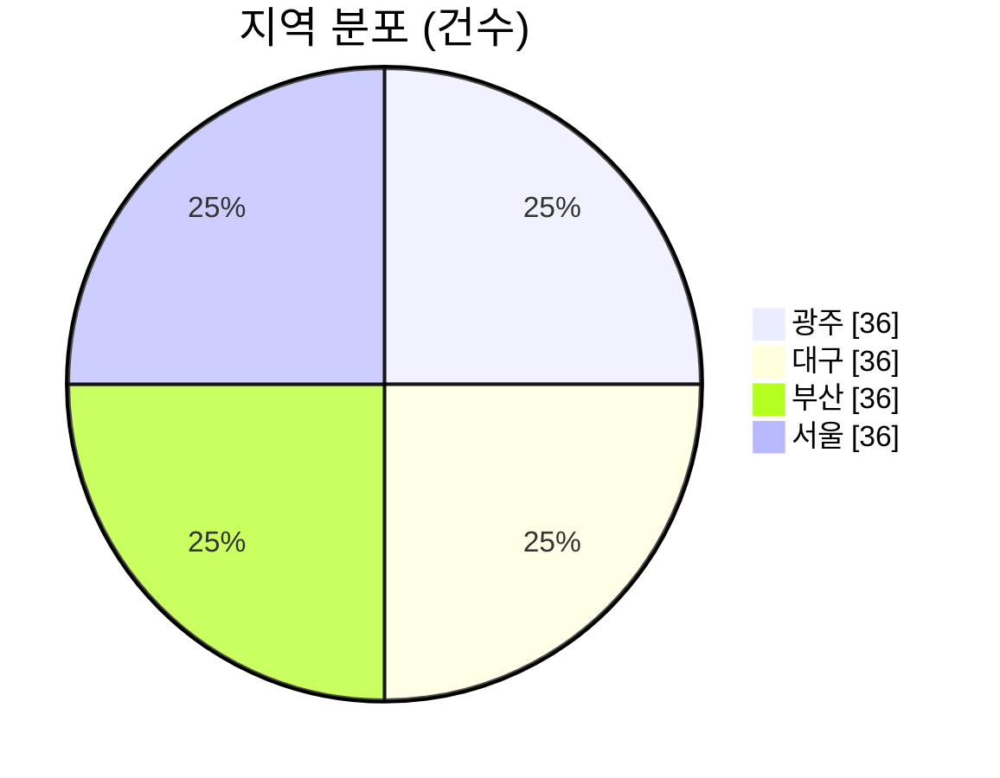
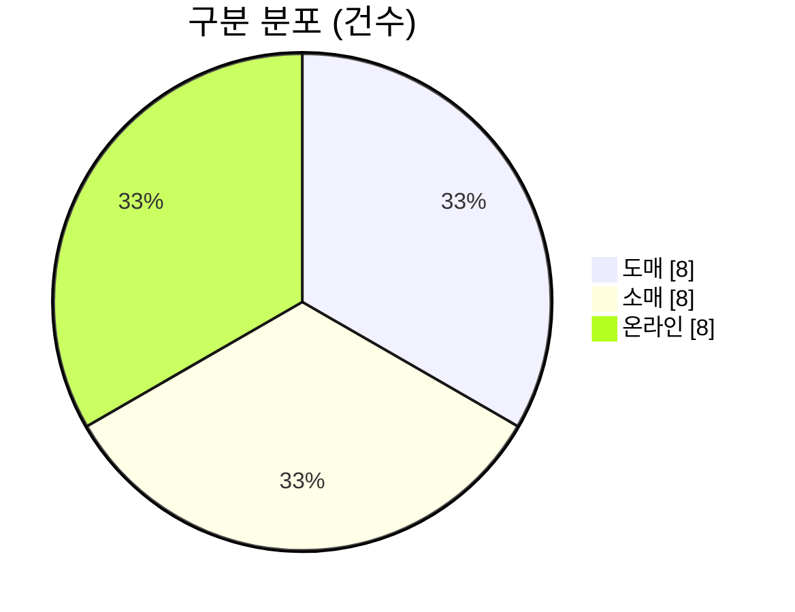

# 데이터 대시보드 (tus4/test)

비공개 저장소 `tus4/data1` 에 올린 Excel 파일(`.xlsx`, `.xlsm`)로부터 **자동 생성된 대시보드**를 공개하는 저장소입니다.

- 🌐 인터랙티브 대시보드: https://tus4.github.io/test/ (GitHub Pages, `docs/` 폴더)
- ⚙️ 동작 방식: `tus4/data1` 에 Excel 파일을 push 하면 data1 의 GitHub Actions 워크플로가 이 저장소의 도구(`dashboard_builder/`)를 가져와 데이터를 요약하고, 결과(`docs/` 와 아래 요약 블록)만 이 저장소에 push 합니다.
- 🔒 공개 범위: 원본 Excel 파일은 절대 이 저장소로 복사되지 않습니다. 공개되는 것은 도구가 만든 파생 데이터뿐이며, 그 범위는 data1 의 `dashboard.config.json` 으로 제한할 수 있습니다. 개인정보로 추정되는 열(전화·이메일·주소·주민번호 등)은 기본적으로 자동 제외됩니다.
- 📖 설정 방법: [SETUP.md](SETUP.md) — 워크플로 파일 복사, 토큰·시크릿, GitHub Pages 설정, 공개 범위 제한, 확인 방법.

이 줄 위의 내용은 자유롭게 수정해도 됩니다. 아래의 START/END 주석 마커 사이만 자동으로 바뀝니다.

<!-- DASHBOARD:START -->
<!-- 이 블록은 자동 생성됩니다. 마커 바깥의 내용만 직접 수정하세요. -->
## 📊 데이터 대시보드 (샘플)

> ⚠️ **샘플 데이터**로 생성된 예시입니다. 실제 데이터를 업로드하면 이 블록이 교체됩니다.

- 🔗 인터랙티브 대시보드: https://tus4.github.io/test/
- 📁 파일 1개 · 시트 3개 · 데이터 지문 `906dfe8fcefe`
- 🔒 공개 범위: 행 데이터 공개 (시트당 최대 1,000행, 50열, 셀 텍스트 200자) · 개인정보로 추정되는 열은 자동 제외

### 📁 sample-data.xlsx

#### 시트: 월별 매출

> 제목 행: 샘플 데이터 (SAMPLE) - 지역별 월 매출 현황 / 이 워크북은 자동 생성된 예시이며 실제 데이터가 아닙니다.

| 항목 | 값 |
|---|---:|
| 총 행 수 | 144 |
| 공개 행 수 | 144 |
| 열 수 (공개/전체) | 7 / 7 |
| 헤더 행 | 4 |
| 열 유형 | 날짜 1, 숫자 3, 비율(%) 1, 텍스트 2 |

| 열 | 유형 | 값 개수 | 요약 |
|---|---|---:|---|
| 일자 | 날짜 | 144 | 2024-01-01 ~ 2024-12-21 |
| 지역 | 텍스트 | 144 | 고유값 4개 · 상위: 광주 (36), 대구 (36), 부산 (36) |
| 제품 | 텍스트 | 144 | 고유값 3개 · 상위: 노트북 (48), 모니터 (48), 키보드 (48) |
| 수량 | 숫자 | 144 | 합계 3,035 · 평균 21.08 · 최소 10 · 최대 32 |
| 단가 | 숫자 | 144 | 합계 76,560,000 · 평균 531,666.67 · 최소 45,000 · 최대 1,200,000 |
| 매출액 | 숫자 | 144 | 합계 1,624,445,000 · 평균 11,280,868.06 · 최소 450,000 · 최대 38,400,000 |
| 목표 달성률 | 비율(%) | 144 | 평균 84.8% · 최소 60.0% · 최대 108.0% |

**지역별 수량 합계**

| 지역 | 수량 | |
|---|---:|:---|
| 서울 | 775 | ████████████████████ |
| 부산 | 768 | ████████████████████ |
| 광주 | 754 | ███████████████████ |
| 대구 | 738 | ███████████████████ |

**미리보기** (처음 8행, 7열)

| 일자 | 지역 | 제품 | 수량 | 단가 | 매출액 | 목표 달성률 |
|---|---|---|---|---|---|---|
| 2024-01-01 | 서울 | 노트북 | 17 | 1,200,000 | 20,400,000 | 66.0% |
| 2024-01-02 | 서울 | 모니터 | 22 | 350,000 | 7,700,000 | 72.0% |
| 2024-01-03 | 서울 | 키보드 | 27 | 45,000 | 1,215,000 | 78.0% |
| 2024-01-07 | 부산 | 노트북 | 20 | 1,200,000 | 24,000,000 | 72.0% |
| 2024-01-08 | 부산 | 모니터 | 25 | 350,000 | 8,750,000 | 78.0% |
| 2024-01-09 | 부산 | 키보드 | 30 | 45,000 | 1,350,000 | 84.0% |
| 2024-01-13 | 대구 | 노트북 | 23 | 1,200,000 | 27,600,000 | 78.0% |
| 2024-01-14 | 대구 | 모니터 | 28 | 350,000 | 9,800,000 | 84.0% |

#### 시트: 거래처

| 항목 | 값 |
|---|---:|
| 총 행 수 | 24 |
| 공개 행 수 | 24 |
| 열 수 (공개/전체) | 5 / 6 |
| 헤더 행 | 1 |
| 열 유형 | 날짜 1, 숫자 1, 텍스트 3 |

| 열 | 유형 | 값 개수 | 요약 |
|---|---|---:|---|
| 거래처명 | 텍스트 | 24 | 고유값 24개 · 상위: 거래처 01 (SAMPLE) (1), 거래처 02 (SAMPLE) (1), 거래처 03 (SAMPLE) (1) |
| 구분 | 텍스트 | 24 | 고유값 3개 · 상위: 도매 (8), 소매 (8), 온라인 (8) |
| 담당자 | 텍스트 | 23 | 고유값 5개 · 상위: 담당자2 (5), 담당자4 (5), 담당자5 (5) |
| 월 거래액 | 숫자 | 23 | 합계 12,252,000 · 평균 532,695.65 · 최소 140,000 · 최대 981,000 |
| 등록일 | 날짜 | 24 | 2023-01-13 ~ 2023-12-24 |

**구분별 월 거래액 합계**

| 구분 | 월 거래액 | |
|---|---:|:---|
| 도매 | 4,796,000 | ████████████████████ |
| 소매 | 3,756,000 | ████████████████ |
| 온라인 | 3,700,000 | ███████████████ |

**미리보기** (처음 8행, 5열)

| 거래처명 | 구분 | 담당자 | 월 거래액 | 등록일 |
|---|---|---|---|---|
| 거래처 01 (SAMPLE) | 소매 | 담당자2 | 237,000 | 2023-02-02 |
| 거래처 02 (SAMPLE) | 온라인 | 담당자3 | 374,000 | 2023-03-03 |
| 거래처 03 (SAMPLE) | 도매 | 담당자4 | 511,000 | 2023-04-04 |
| 거래처 04 (SAMPLE) | 소매 | 담당자5 |  | 2023-05-05 |
| 거래처 05 (SAMPLE) | 온라인 | 담당자1 | 785,000 | 2023-06-06 |
| 거래처 06 (SAMPLE) | 도매 | 담당자2 | 922,000 | 2023-07-07 |
| 거래처 07 (SAMPLE) | 소매 |  | 159,000 | 2023-08-08 |
| 거래처 08 (SAMPLE) | 온라인 | 담당자4 | 296,000 | 2023-09-09 |

- ℹ️ 열 이름이 개인정보로 추정되어 자동 제외한 열 (공개하려면 allow_columns 에 추가): 연락처
- ℹ️ 오류 셀 1개(#DIV/0!, #N/A 등)는 빈 값으로 처리했습니다.
- ℹ️ '-', 'N/A' 같은 자리표시 값 1개는 빈 값으로 처리했습니다.
- ℹ️ 텍스트로 저장된 숫자/날짜를 변환한 열: 월 거래액

#### 시트: 메모

_빈 시트입니다._

<!-- DASHBOARD:END -->
